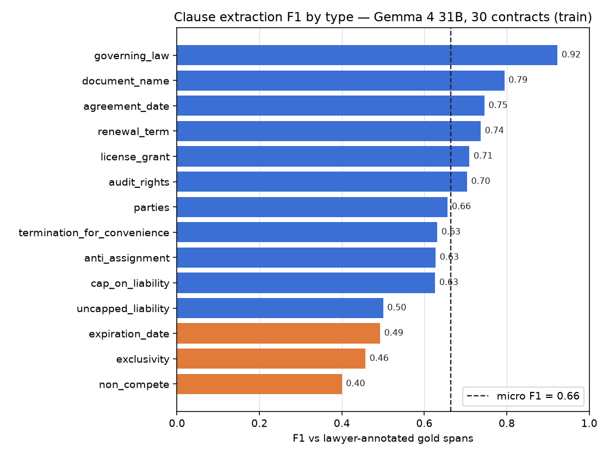
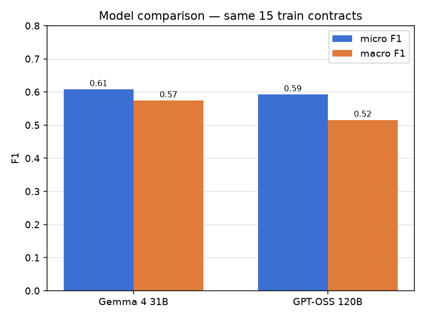

# ClauseLens

[](https://github.com/Volodymyr4K/clauselens/actions/workflows/ci.yml)

AI-powered contract analysis: extracts key clauses from legal contracts, flags
risky terms, and answers questions about a document with **exact citations** —
and, unusually for a side project, **honestly evaluated against expert
annotations** from the [CUAD dataset](https://www.atticusprojectai.org/cuad)
(510 commercial contracts annotated by lawyers).

The point of this project is not "an LLM reads contracts." It is the
**evaluation discipline** around it: every number below is measured against
lawyer-annotated ground truth, reproducible by running the eval scripts, and
reported with its weak spots intact.

---

## What it does

- **Clause extraction** — finds and classifies 14 key clause types (governing
  law, liability caps, termination, exclusivity, non-compete, renewal, …) and
  returns the exact span of each, grounded in the source text.
- **Risk flagging** — surfaces the risk-bearing clauses (liability, audit,
  termination, exclusivity, …) for review.
- **Q&A with citations** — ask a question about a contract; the answer is
  backed by verbatim quotes from the document, or it honestly says the
  contract does not address the question.
- **Honest evaluation** — precision / recall / F1 per clause type against a
  held-out test split, plus a citation-quality eval for the Q&A path.

Everything runs on free, open models through any OpenAI-compatible endpoint
(OpenRouter by default); no proprietary API is required.

---

## Results

> Development numbers are on the CUAD **train** split (used to design prompts).
> The **test** split is held out and only measured at the end — see status
> below. Span match counts a prediction correct when it overlaps a gold span
> (char IoU ≥ 0.3) **or** reproduces it verbatim; both that score and the
> stricter positional-only score are reported, nothing is hidden behind a
> generous threshold.

### Clause extraction (default model: Gemma 4 31B, 30 train contracts)

| | micro P | micro R | micro F1 | macro F1 |
|---|---|---|---|---|
| IoU-or-verbatim match | 0.62 | 0.71 | **0.66** | 0.643 |
| strict positional-only | 0.59 | — | 0.614 | 0.604 |



Strong, stable types: `governing_law` (F1 0.92), `document_name` (0.79),
`agreement_date` (0.75), `renewal_term` (0.74), `license_grant` (0.71).
Weak types, honestly (orange): `expiration_date` (0.49 — over-fires),
`exclusivity` (0.46), `non_compete` (0.40 on few examples). Full per-clause
table:
[`eval_runs/gemma4-31b-iter2-train30/report.md`](eval_runs/gemma4-31b-iter2-train30/report.md).

### Model comparison (same 15 train contracts, identical pipeline)

| Model | micro F1 | macro F1 | avg / contract |
|---|---|---|---|
| **Gemma 4 31B** (default) | **0.61** | **0.574** | **65 s** |
| GPT-OSS 120B | 0.59 | 0.515 | 115 s |



The smaller model chosen for speed is **also at least as accurate** and ~2×
faster, so nothing is left on the table by using it. (Llama 3.3 70B was
excluded: its free endpoint was too rate-limited to complete a run — a real
free-tier reliability caveat, not a quality judgment.)

### Q&A citations (10 train contracts, vs gold spans)

- **Citation hit rate (clause present): 0.68** — a citation lands on the right
  passage (covers ≥ 50 % of a gold span, or matches verbatim).
- **Absence handling (clause absent): 0.83** — when the contract does not
  address a question, Q&A correctly cites nothing instead of inventing support.

Strong on distinctive-keyword clauses (`renewal_term`, `termination` 1.00,
`agreement_date` 1.00, `expiration_date` 0.80); weaker where retrieval is
harder. Detail:
[`eval_runs/qa-gemma4-31b-iter1-train10/report.md`](eval_runs/qa-gemma4-31b-iter1-train10/report.md).

### Held-out test split

🚧 **In progress.** A partial run on the 20 shorter test contracts gives micro
F1 0.76 / macro 0.77, but that subset is length-biased toward easier
contracts (the longer half is pending a daily free-tier limit reset), so this
is **not** the final headline and is expected to settle lower, near the train
number. The full n=40 test result will replace this line once measured.

---

## How it works

```
contract text
   │
   ├─ extraction ──────────────────────────────────────────────┐
   │   two-phase:                                                │
   │   · header phase  → metadata (title, parties, date) from    │
   │                     the preamble + signature block only     │
   │   · body phase    → remaining clauses over overlapping       │
   │                     chunks                                   │
   │   every quoted span is GROUNDED in the source text;          │
   │   an ungrounded quote is dropped, never trusted  ───────────┤
   │                                                             ▼
   │                                                   clauses + risk flags
   │
   └─ Q&A ──────────────────────────────────────────────────────┐
       BM25 retrieval over passages (head-anchored) →            │
       answer using only retrieved passages →                    │
       each citation grounded back into those passages ──────────┤
                                                                  ▼
                                                      answer + citations
```

**Design choices that matter:**

- **Grounding, not trust.** Both extraction and Q&A make the model quote
  verbatim, then locate the quote in the source. A quote that cannot be found
  is discarded. This is the anti-hallucination backbone: citations are real by
  construction, not by hope.
- **Provider-agnostic.** One OpenAI-compatible client; the model is swapped via
  `.env`, which is what made the model comparison a config change, not a
  rewrite.
- **One system done properly**, not a platform half-built: clause extraction +
  cited Q&A + a real eval harness, scoped deliberately.

---

## Evaluation methodology

What makes the numbers trustworthy:

- **Held-out test split.** Prompts are tuned on `train`; the final score is on
  `test`, which the prompts never saw. Train/test membership is taken from
  CUAD's own split, verified disjoint.
- **Two matching criteria, both reported.** A generous text-aware match and a
  strict positional IoU match are printed side by side, so the effect of the
  lenient arm is visible. (The text-aware arm exists because contract titles
  appear verbatim at several offsets; pure offset matching scored a correct
  answer as both a false positive and a false negative — diagnosed, not
  assumed.)
- **Absence is scored.** "There is no such clause" is half the value to a
  reviewer, so specificity on absent clauses is measured, not ignored.
- **Endpoint failures are not silently counted as model errors.** Chunks lost
  to rate-limiting are tracked; a contract whose chunks mostly failed is
  excluded and retried rather than baked into recall as false negatives.
- **Resumable, deterministic runs.** Predictions are cached per contract;
  contract selection is a fixed length-stratified stride.

---

## Limitations

Stated plainly, because hiding them would defeat the point:

- **Free-model ceiling.** Numbers come from free, mid-sized open models under a
  daily request cap. A stronger model would likely score higher; this is a
  budget choice, not a quality ceiling of the approach.
- **Span granularity.** CUAD lawyers annotate minimal spans; the model tends to
  quote enclosing sentences. The IoU ≥ 0.3 threshold accommodates this and is
  reported alongside the strict score, but it is a real modelling choice.
- **`parties` precision.** The model over-quotes party aliases (`Company`,
  `Distributor`) through the body; precision there is ~0.56 even after a
  per-entity prompt fix.
- **Low-frequency clauses are noisy.** `non_compete`, `uncapped_liability`,
  `exclusivity` appear in only a handful of contracts per sample, so their
  per-type scores swing and should not be over-read until measured on more
  data.
- **Not legal advice.** A portfolio/engineering demo, not a substitute for a
  lawyer.

---

## Getting started

```bash
uv sync --extra dev
./scripts/download_data.sh                 # fetch CUAD v1 (~58 MB)

# set your key (any OpenAI-compatible endpoint; OpenRouter by default)
echo 'CLAUSELENS_API_KEY=sk-or-...' > .env

# extract clauses from one contract and compare with gold
uv run python scripts/extract_one.py 0

# ask a question about a contract
uv run python scripts/ask.py 0 "Which law governs this agreement?"

# launch the web UI: clauses highlighted in the document + cited Q&A
# (the contract browser works offline from cached extractions; live Q&A
#  needs an API key and quota)
uv run uvicorn clauselens.web:app --port 8077   # then open http://localhost:8077

# run the extraction eval (resumable; space requests to respect free limits)
CLAUSELENS_MIN_INTERVAL=3 uv run python scripts/run_eval.py \
    --run my-run --split train -n 30

# run the Q&A citation eval
uv run python scripts/run_qa_eval.py --run my-qa-run -n 10
```

Tests and linting:

```bash
uv run pytest -q          # 49 tests
uv run ruff check src scripts tests
uv run --extra viz python scripts/plot_results.py   # regenerate result charts
```

---

## License

MIT. CUAD dataset © The Atticus Project, CC BY 4.0.
